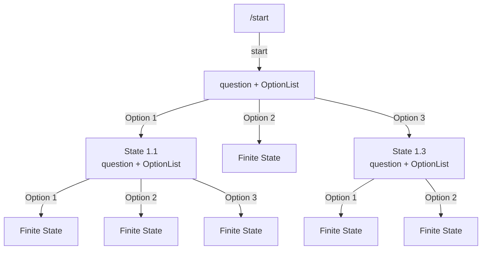
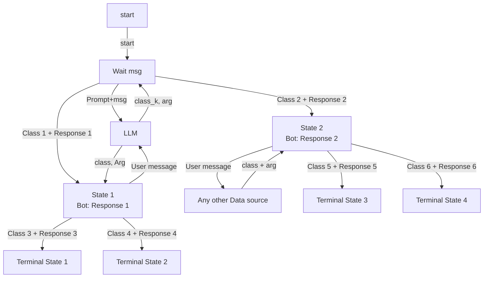

# Zerocode Telegram bot builder
Tool to instant buiding telegram bots by draw.io described workflow.
- Describe flow
- Export it as xml
- Send to app by existing endpoint
- Pay for zerocoding in crypto
- Get your very usefull and unique docker image with binary volumes , ready to deployment in International Scampire

"Кажется говно конечно, но местным нравится"

# 2 different WORKFLOWS
I. ##Use /start, then bot begin dialog.     

init state
Bot: ->question                             /     \
      [options]                option[1]   /       \option[2] 
while state not finite:                   /          \ 
  User: option_k                      state1          state2
  Bot: change state -> change options
Bot return finite state
Usage: customizable classification
"Узнай какой ты смешарик)"

II 

Usage: Flexiable scenarios to LLM agents 
classificator/oracle - its any data resourse which can return different response

"Автоматизация техподдержки, потому что пользуясь анонимностью связи, и стремлением владельцев отгородить себя от обратной связи эти ублюдки с годами трансформируются в нечто среднее между Theon Greyjoy and Eichmann"
